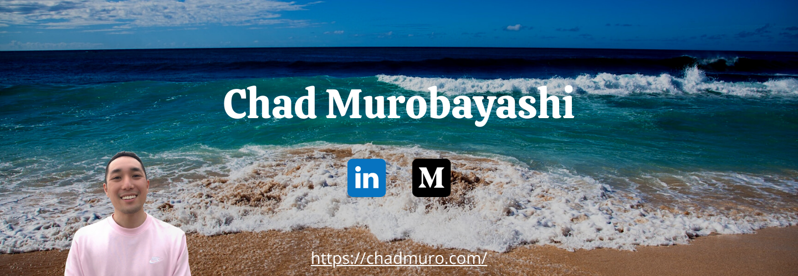

I'm a Frontend Developer living in Tokyo, Japan, born and raised in Hawaii. I am currently passionate about building JavaScript and React Apps using Hooks, Context API, Redux, Firebase, Sass, and Material-UI. When I'm not developing and building things, I enjoy writing blog articles, photography, basketball, and playing with my French Bulldog.

### :pencil: Blog Posts
- [4 Things I Learned from Reading the React Hooks API](https://medium.com/javascript-in-plain-english/4-things-i-learned-from-reading-the-react-hooks-api-ad0d48374901)
- [Doubly Linked Lists With JavaScript](https://medium.com/javascript-in-plain-english/doubly-linked-lists-with-javascript-9c20a9dc4fb3)
- [Create a Customized Color Theme in Material-UI](https://medium.com/swlh/create-a-customized-color-theme-in-material-ui-7205163e541f)

### :computer: Projects
- Japan Hoops :basketball:  *coming soon*
- [Tokyo Frenchies](https://tokyo-frenchies.web.app/) :dog:
- [IpuGram](https://ipugram.web.app/) :camera:

### :seedling: Currently Learning
- Typescript
- Node.js, Express, MongoDB

### :mailbox: Where To Find Me
- [Website](https://chadmuro.com/)
- [LinkedIn](https://www.linkedin.com/in/chadmuro/)
- [Medium](https://chadmuro.medium.com/)
